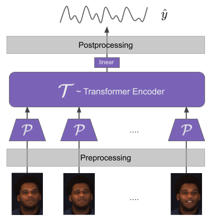
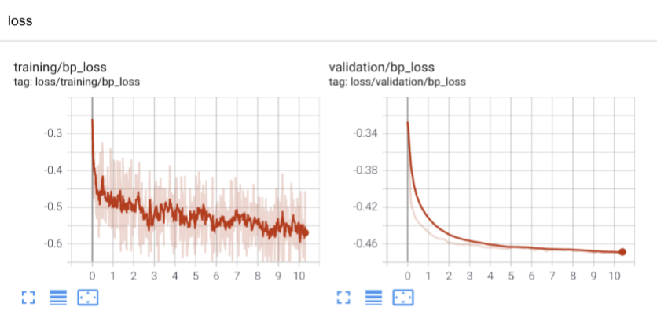

## Instantaneous Physiological Estimation using Video Transformers (2022)

[Ambareesh Revanur](https://www.linkedin.com/in/ambareeshr/), [Ananyananda Dasari](https://www.linkedin.com/in/ananyananda-dasari/), [Conrad Tucker](https://engineering.cmu.edu/directory/bios/tucker-conrad.html), [Laszlo Jeni](https://www.laszlojeni.com/)


[](https://opensource.org/licenses/MIT)
[](https://www.python.org/)

[Download Paper](https://arxiv.org/pdf/2202.12368.pdf), [Download V4V Dataset](https://vision4vitals.github.io/v4v_dataset.html)

-------------

### Summary

Video-based physiological signal estimation has been limited primarily to predicting episodic scores in windowed intervals. While these intermittent values are useful, they provide an incomplete picture of patients' physiological status and may lead to late detection of critical conditions. We propose a video Transformer for estimating instantaneous heart rate and respiration rate from face videos. Physiological signals are typically confounded by alignment errors in space and time. To overcome this, we formulated the loss in the frequency domain. 



### Code

In this work, we followed the below folder structure,

```
Instantaneous_Transformer
  |- code/inst_transformer
  |     |- dataloader.py
  |     |- globals.py
  |     |- main.py
  |     |- ...
  |
  |- data/
  |     |- Training/
  |     |- Validation/
  |     | ...
  |- weights/
  |- summaries/
```

Navigate into `code/inst_transformer` and run `python main.py --args`. See below for list of arguments.


1. `python main.py --name vid_tra_1 --seqlen 100 --gpu 0 --phys HR`
2. `python main.py --name vid_tra_2 --seqlen 1000 --gpu 0 --phys RR --batch_size 4 --numlayer 1`

The loss plots should be saved in `summaries` folder. 

#### Training curves

The loss plots will look like below:



-----------

### Citation

If you found this code repository useful, please consider citing the following works.

```
@article{revanur2022transformers,
  title={Instantaneous Physiological Estimation using Video Transformers},
  author={Revanur, Ambareesh and Dasari, Ananyananda and Tucker, Conrad and Jeni, L{\'a}szl{\'o} A},
  journal={Multimodal AI in Healthcare: A Paradigm Shift in Health Intelligence, Studies in Computational Intelligence},
  year={2022}
}
```

```
@inproceedings{revanur2021first,
  title={The first vision for vitals (v4v) challenge for non-contact video-based physiological estimation},
  author={Revanur, Ambareesh and Li, Zhihua and Ciftci, Umur A and Yin, Lijun and Jeni, L{\'a}szl{\'o} A},
  booktitle={Proceedings of the IEEE/CVF International Conference on Computer Vision},
  pages={2760--2767},
  year={2021}
}
```

### Contact

Please use the issues tab for any queries or contact `ambareesh (dot) r (at) gmail (dot) com`


#### Credits

We thank authors of [RemotePPG](https://github.com/ToyotaResearchInstitute/RemotePPG) and [imresize](https://github.com/fatheral/matlab_imresize/blob/master/imresize.py) for open-sourcing their code. 

